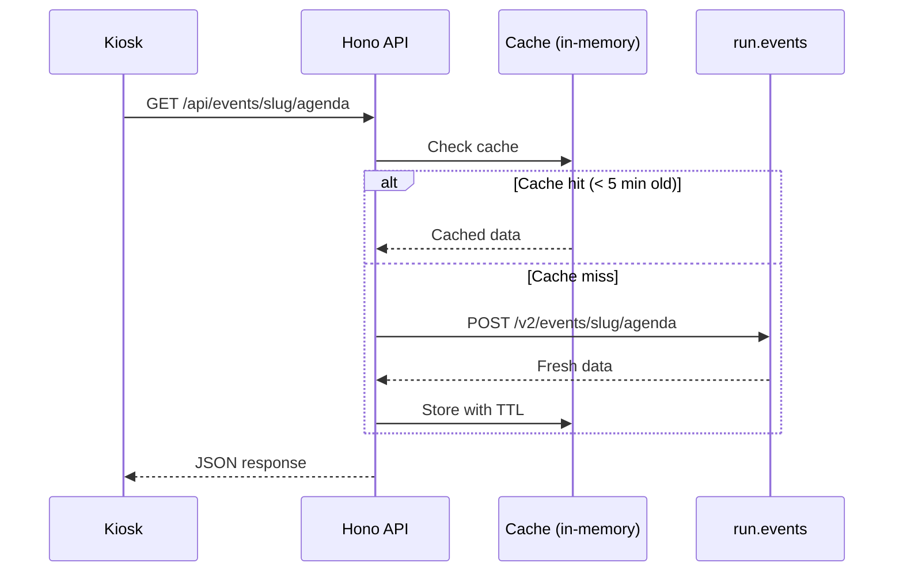

# API Reference

The Hono backend serves as a BFF (Backend-for-Frontend) proxy between the kiosk and external APIs, plus a CRUD layer for admin-managed data.

## Public Endpoints (no auth)

Used by the kiosk SPA.

| Method | Path | Description |
|--------|------|-------------|
| `GET` | `/api/health` | Health check |
| `GET` | `/api/events/:slug/agenda` | Full agenda with sessions grouped by day |
| `GET` | `/api/events/:slug/sessions/now` | Sessions happening right now (computed server-side) |
| `GET` | `/api/events/:slug/speakers` | All speakers |
| `GET` | `/api/events/:slug/booths` | Exhibitor booths |
| `GET` | `/api/events/:slug/search?q=` | Text search across sessions/speakers (min 4 chars) |
| `GET` | `/api/events/:slug/sponsors` | Sponsors with tier info |
| `GET` | `/api/events/:slug/floor-maps` | Floor maps with hotspot polygons |
| `GET` | `/api/events/:slug/config` | Event configuration (branding, languages) |
| `GET` | `/api/events/:slug/i18n-overrides` | Translation overrides per language |

## Admin Endpoints (JWT auth required)

Used by the admin panel. All require `Authorization: Bearer <token>` header.

| Method | Path | Description |
|--------|------|-------------|
| `POST` | `/api/auth/login` | Login, returns JWT token |
| `GET/PUT` | `/api/admin/events/:slug/config` | Event configuration |
| `GET/POST` | `/api/admin/events/:slug/sponsors` | List / create sponsors |
| `PUT/DELETE` | `/api/admin/events/:slug/sponsors/:id` | Update / delete sponsor |
| `GET/POST` | `/api/admin/events/:slug/sponsor-tiers` | List / create tiers |
| `PUT/DELETE` | `/api/admin/events/:slug/sponsor-tiers/:id` | Update / delete tier |
| `GET/POST` | `/api/admin/events/:slug/floor-maps` | List / create floor maps |
| `PUT/DELETE` | `/api/admin/events/:slug/floor-maps/:id` | Update / delete floor map |
| `POST` | `/api/admin/upload` | Upload image to Blob Storage |
| `GET/PUT` | `/api/admin/events/:slug/i18n-overrides` | Get / update translation overrides |

## Caching

In-memory `Map` with 5-minute TTL. Sufficient for single-container deployment serving a handful of kiosks.

## run.events API Notes

- Base URL: `https://modesty.runevents.net`
- Swagger: `https://modesty.runevents.net/swagger/index.html`
- Auth: `ApiKey` header (event-level key)
- **Uses POST for data endpoints** (not GET) — this is unusual but intentional
- Search endpoint is the exception: uses GET with `?q=` parameter
- Search requires minimum 4 characters

## Environment Variables

### API (`packages/api/.env`)

| Variable | Description | Default |
|----------|-------------|---------|
| `PORT` | API server port | `3001` |
| `EVENT_SLUG` | Event slug for run.events | `experts-live-netherlands-2026` |
| `RUN_EVENTS_API_KEY` | run.events API key | Required |
| `COSMOS_CONNECTION_STRING` | Azure Cosmos DB connection | Required |
| `JWT_SECRET` | Secret for signing JWT tokens | Required |
| `STORAGE_CONNECTION_STRING` | Azure Blob Storage connection | Required |
| `NODE_ENV` | Environment | `development` |

### Kiosk (`packages/kiosk/.env`)

| Variable | Description | Default |
|----------|-------------|---------|
| `VITE_API_URL` | API base URL (empty uses Vite proxy) | `` |
| `VITE_EVENT_SLUG` | Event slug | `experts-live-netherlands-2026` |

### Admin (`packages/admin/.env`)

| Variable | Description | Default |
|----------|-------------|---------|
| `VITE_API_URL` | API base URL | `http://localhost:3001` |
| `VITE_EVENT_SLUG` | Event slug | `experts-live-netherlands-2026` |
