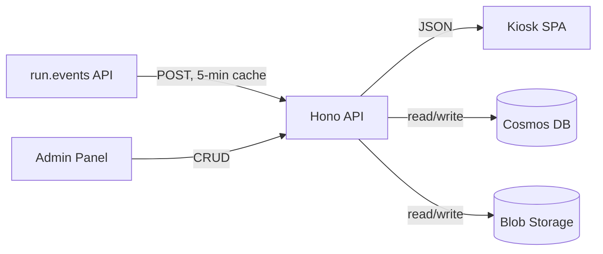
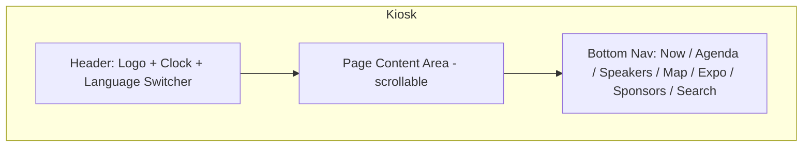
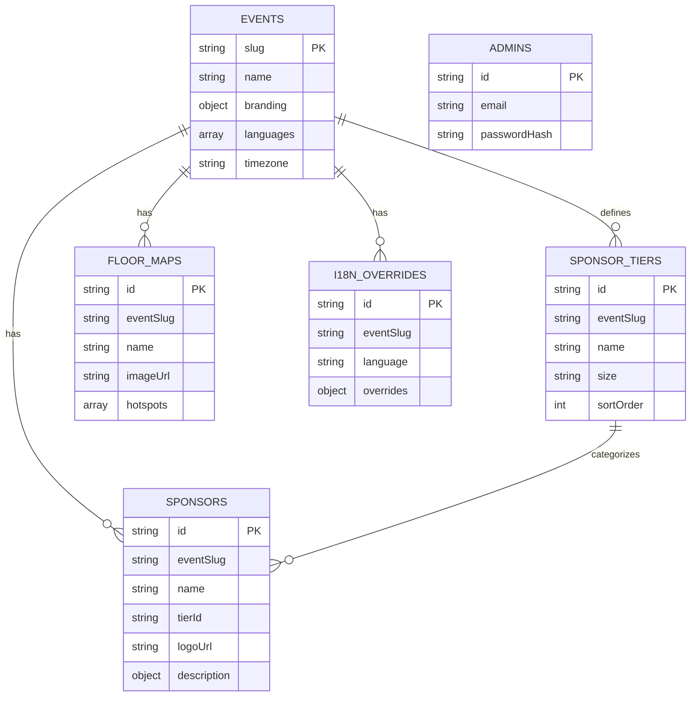

# Architecture

## Tech Stack

| Layer | Technology | Why |
|-------|-----------|-----|
| **Frontend (kiosk + admin)** | React 19 + TypeScript + Vite + Tailwind v4 | SPA with large touch-target UI, no SSR needed |
| **Backend** | Hono + Node.js + TypeScript | Lightweight BFF/proxy, first-class TypeScript |
| **Database** | Azure Cosmos DB (free tier) | Zero cost, document model fits the data |
| **File storage** | Azure Blob Storage | Floor map images, sponsor logos |
| **SPA hosting** | Azure Static Web Apps (free tier) | Free SPA hosting with CI/CD |
| **API hosting** | Azure Container Apps (Consumption) | Scales to zero between events |
| **Monorepo** | pnpm workspaces | Shared types/constants across packages |

### Key Libraries

| Library | Purpose |
|---------|---------|
| `@tanstack/react-query` | Data fetching with caching, retry, stale-while-revalidate |
| `react-simple-keyboard` | On-screen virtual keyboard for kiosk search |
| `react-konva` | Canvas-based polygon editor for admin hotspot drawing |
| `@use-gesture/react` | Swipe gestures for day/map switching |
| `react-i18next` | Multi-language support (NL, EN, DE, FR) |
| `zustand` | Lightweight state management (kiosk inactivity, touch tracking) |
| `framer-motion` | Touch-optimized press animations |
| `date-fns` | Date/time formatting and timezone logic |

## Project Structure

```
ziggy/
├── packages/
│   ├── shared/          # TypeScript types, constants, utils
│   ├── api/             # Hono backend (BFF proxy + admin API + Cosmos DB)
│   ├── kiosk/           # Kiosk SPA (touch-optimized, attendee-facing)
│   └── admin/           # Admin panel SPA (event config, sponsors, floor maps)
├── docs/                # Documentation
├── .github/workflows/   # CI/CD (lint on PR, deploy on push to main)
├── pnpm-workspace.yaml
└── tsconfig.base.json
```

## Data Flow



- **Session, speaker, and booth data**: fetched from the run.events API via POST requests, cached in-memory for 5 minutes
- **Sponsors, floor maps, event config, i18n overrides**: managed by admins, stored in Cosmos DB
- **Images** (logos, floor map images): stored in Azure Blob Storage

## Kiosk Screen Layout



## Database Schema

Cosmos DB containers (all partitioned by event slug):



## Code Conventions

- TypeScript strict mode everywhere
- ESM (`"type": "module"`) in all packages
- Shared types use `.js` extension in imports (TypeScript ESM requirement)
- Prettier: no semicolons, single quotes, trailing commas
- API routes return JSON, errors use `{ error: string }` shape
- Kiosk uses React Query for server state, Zustand for UI state
- i18n: `react-i18next` with inline JSON resources (no HTTP backend for translations)
- Tailwind v4 with `@tailwindcss/vite` plugin — theme defined via `@theme` in CSS, not config file
