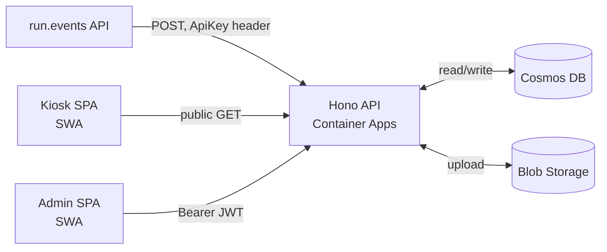
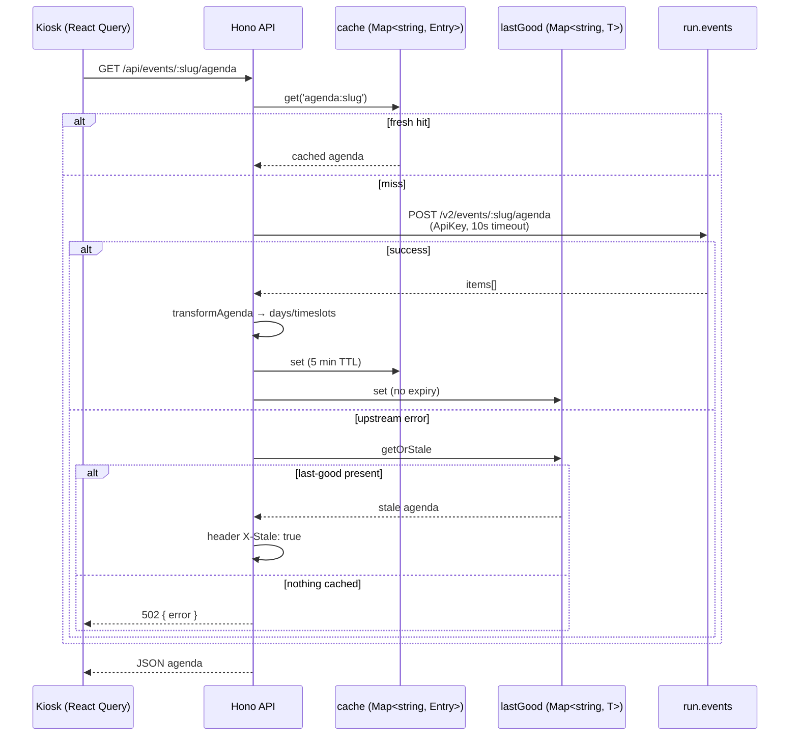
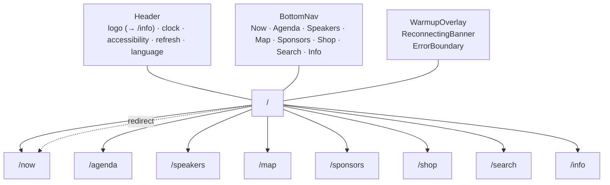
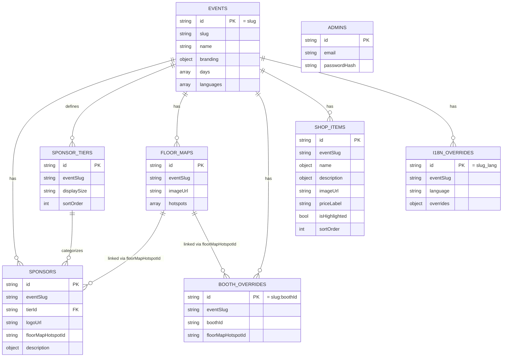

# Architecture

Ziggy is a pnpm monorepo with four packages, an Azure backend, and a single
upstream data source ([run.events](https://run.events)). The kiosk is a touch
SPA, the admin is a separate SPA for organizers, and the API is a thin Hono
proxy with a small admin-managed data layer in Cosmos DB.

## Packages

| Package | Role |
|---|---|
| `@ziggy/shared` | TypeScript types and constants (run.events response shapes, transformed types, admin-managed types, language list, cache TTL). Imported by every other package. |
| `@ziggy/api` | Hono v4 backend on Node.js. Proxies run.events with caching, exposes a CRUD layer for admin data, signs JWTs, validates uploads. |
| `@ziggy/kiosk` | React 19 SPA optimized for 1080×1920 portrait touch kiosks. Reads only public endpoints. |
| `@ziggy/admin` | React 19 SPA for event organizers. JWT-authenticated, talks to `/api/admin/*`. |

`@ziggy/shared` must be built first — the API and SPAs import it as a
workspace dependency. Shared types use `.js` extensions in their relative
imports (e.g. `import type { Sponsor } from './sponsor.js'`) because TypeScript
ESM resolution requires the emitted file extension, not the source one.

## High-level data flow

```mermaid
flowchart LR
    RE[run.events API]
    API[Hono API<br/>Container Apps]
    DB[(Cosmos DB)]
    BS[(Blob Storage)]
    K[Kiosk SPA<br/>SWA]
    A[Admin SPA<br/>SWA]

    RE -- POST, ApiKey header --> API
    API <-- read/write --> DB
    API <-- upload --> BS
    K -- public GET --> API
    A -- Bearer JWT --> API
```

Two data ownerships:

| Source | Data |
|---|---|
| **run.events** (POST endpoints, 5-min cache) | Agenda items, speakers, booths, partnerships |
| **Cosmos DB** (admin CRUD) | Event config, sponsors, sponsor tiers, floor maps + hotspots, i18n overrides, booth overrides, shop items, admin users |
| **Blob Storage** | Sponsor logos, shop item images, floor map images, event logos (uploaded via `/api/admin/upload`) |

## Why each piece

- **Hono** — minimal, first-class TypeScript, runs anywhere with a `fetch`
  interface; pairs with `@hono/node-server` for the Container App. The API is
  small and Hono's middleware shape (`secureHeaders`, `bodyLimit`, `cors`)
  composes cleanly for what we need.
- **TanStack Query (kiosk)** — built-in retry with exponential backoff, stale
  while-revalidate, persistence to `localStorage`. The kiosk needs to survive
  flaky WiFi during the event; persistence + `networkMode: 'offlineFirst'` give
  us "last known good" behavior across page reloads.
- **Zustand (kiosk)** — all per-session UI state (open modal IDs, search query,
  selected day, label filter, font scale, theme, map highlight) lives in one
  small store. The inactivity reset clears the whole store atomically — this is
  the reason we centralized state instead of leaving it in components.
- **Tailwind v4** — uses the Vite plugin and an `@theme` block in
  `index.css`. There is no `tailwind.config.js`. Custom tokens emit as
  `var(--color-*)` references, so `[data-theme='high-contrast']` overrides
  cascade to every utility automatically.
- **Cosmos DB serverless** — admin writes are infrequent and small; serverless
  RU pricing fits the access pattern and the free tier covers it entirely.

## Agenda data flow

```mermaid
sequenceDiagram
    participant K as Kiosk (React Query)
    participant API as Hono API
    participant C as cache (Map<string, Entry>)
    participant LG as lastGood (Map<string, T>)
    participant RE as run.events

    K->>API: GET /api/events/:slug/agenda
    API->>C: get('agenda:slug')
    alt fresh hit
        C-->>API: cached agenda
    else miss
        API->>RE: POST /v2/events/:slug/agenda<br/>(ApiKey, 10s timeout)
        alt success
            RE-->>API: items[]
            API->>API: transformAgenda → days/timeslots
            API->>C: set (5 min TTL)
            API->>LG: set (no expiry)
        else upstream error
            API->>LG: getOrStale
            alt last-good present
                LG-->>API: stale agenda
                API->>API: header X-Stale: true
            else nothing cached
                API-->>K: 502 { error }
            end
        end
    end
    API-->>K: JSON agenda
```

The transformation flattens run.events' single `RunEventsAgendaItem[]` array
into a structured `Agenda { days: [{ date, timeslots: [{ startTimeGroup,
sessions[] }] }] }` shape. The transform groups by `startDate.substring(0,10)`
for the day, then by `startTimeGroup` for the timeslot, picks the earliest
start and latest end across the timeslot, and copies the cleaned-up session
fields. See `packages/api/src/lib/run-events.ts:48`.

The kiosk supports a `?now=<ISO-8601>` URL override for previewing what
`/now`, `/agenda` jump-to-now, and break cards look like at a given moment.
The override flows through both the kiosk's `useClockTick` hook (so all
client-side clocks show the override time) **and** as a forwarded query
param to `GET /api/events/:slug/sessions/now?now=…`, so the API filters
"current" / "upNext" / "currentBreaks" against the same instant. Without the
server forwarding, only client clocks would shift while the API kept
returning live data.

## Kiosk page tree

```mermaid
flowchart TD
    Root["/"] --> Now["/now"]
    Root -.redirect.-> Now
    Root --> Agenda["/agenda"]
    Root --> Speakers["/speakers"]
    Root --> Map["/map"]
    Root --> Sponsors["/sponsors"]
    Root --> Shop["/shop"]
    Root --> Search["/search"]
    Root --> Info["/info"]

    H["Header<br/>logo (→ /info) · clock · accessibility · refresh · language"]
    BN["BottomNav<br/>Now · Agenda · Speakers · Map · Sponsors · Shop · Search · Info"]
    Overlays["WarmupOverlay<br/>ReconnectingBanner<br/>ErrorBoundary"]

    H --- Root
    BN --- Root
    Overlays --- Root
```

Every route is wrapped in `<ErrorBoundary>` and lazily loaded with
`React.lazy`. The `WarmupOverlay` gates first-paint until the core queries
(`agenda`, `now-sessions`, `event-config`) succeed once or 15 seconds elapse.
The `ReconnectingBanner` appears as a thin yellow strip after 10 seconds of
sustained query errors.

## Cosmos containers

```mermaid
erDiagram
    EVENTS {
        string id PK "= slug"
        string slug
        string name
        object branding
        array days
        array languages
    }
    SPONSORS {
        string id PK
        string eventSlug
        string tierId FK
        string logoUrl
        string floorMapHotspotId
        object description
    }
    SPONSOR_TIERS {
        string id PK
        string eventSlug
        string displaySize
        int sortOrder
    }
    FLOOR_MAPS {
        string id PK
        string eventSlug
        string imageUrl
        array hotspots
    }
    BOOTH_OVERRIDES {
        string id PK "= slug:boothId"
        string eventSlug
        string boothId
        string floorMapHotspotId
    }
    SHOP_ITEMS {
        string id PK
        string eventSlug
        object name
        object description
        string imageUrl
        string priceLabel
        bool isHighlighted
        int sortOrder
    }
    I18N_OVERRIDES {
        string id PK "= slug_lang"
        string eventSlug
        string language
        object overrides
    }
    ADMINS {
        string id PK
        string email
        string passwordHash
    }

    EVENTS ||--o{ SPONSORS : has
    EVENTS ||--o{ SPONSOR_TIERS : defines
    EVENTS ||--o{ FLOOR_MAPS : has
    EVENTS ||--o{ BOOTH_OVERRIDES : has
    EVENTS ||--o{ SHOP_ITEMS : has
    EVENTS ||--o{ I18N_OVERRIDES : has
    SPONSOR_TIERS ||--o{ SPONSORS : categorizes
    FLOOR_MAPS ||--o{ SPONSORS : "linked via floorMapHotspotId"
    FLOOR_MAPS ||--o{ BOOTH_OVERRIDES : "linked via floorMapHotspotId"
```

All containers except `events` and `admins` partition on `eventSlug`. `events`
partitions on `slug` (effectively the same value). `admins` partitions on
`email`.

## See also

- [data-model.md](./data-model.md) — type definitions, run.events transform
- [state-management.md](./state-management.md) — Zustand store and reset flow
- [api.md](./api.md) — full endpoint reference
- [security.md](./security.md) — threat model and hardening
- [deployment.md](./deployment.md) — Azure topology and CI/CD
