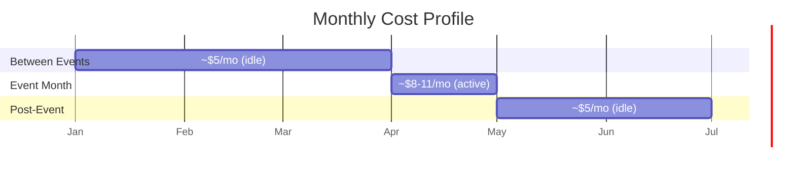

# Azure Cost Estimate

Ziggy is designed for minimal Azure spend, leveraging free tiers wherever possible. Cost estimates are based on a typical conference event scenario (3-day event, ~10 kiosk screens, ~50 admin panel sessions/month).

## Monthly Cost Breakdown

| Resource | SKU | Estimated Monthly Cost | Notes |
|----------|-----|----------------------:|-------|
| **Cosmos DB** | Serverless (free tier) | **$0** | 1,000 RU/s + 25 GB included free |
| **Static Web Apps** | Free tier | **$0** | Kiosk SPA hosting, custom domain, SSL |
| **Container Apps** | Consumption | **$0–5** | Scales to zero when idle; ~$0 between events |
| **Container Registry** | Basic | **$5** | Docker image storage |
| **Blob Storage** | Standard LRS | **$0.10–1** | Floor maps + sponsor logos (~100 MB) |
| | | | |
| **Total** | | **$5–11/month** | |

## Cost by Usage Period

### Between Events (~$5/month)

- Container Apps scales to **zero replicas** — no compute cost
- Cosmos DB free tier covers idle storage
- Only Container Registry incurs a fixed monthly cost

### During an Event (~$8–11/month)

- Container Apps scales up to handle kiosk traffic (0→2 replicas)
- Consumption plan charges per vCPU-second and GB-second:
  - 0.25 vCPU + 0.5 GB container, running ~12 hours/day for 3 days
  - Estimated compute: **$1–3** for the event period
- Cosmos DB stays within free tier limits (low RU consumption)
- Blob Storage: negligible (a few cents for image reads)

## Detailed Pricing Breakdown

### Azure Container Apps (Consumption)

| Metric | Free Allowance | Rate Beyond Free | Ziggy Usage |
|--------|---------------|----------------:|-------------|
| vCPU-seconds | 180,000/mo | $0.000024/s | ~50,000/mo during events |
| GB-seconds | 360,000/mo | $0.000003/s | ~100,000/mo during events |
| Requests | 2M/mo | $0.40/M | ~10,000/mo |

With the generous free allowances, most months Ziggy stays within free limits.

### Azure Cosmos DB (Serverless)

| Metric | Free Tier | Ziggy Usage |
|--------|-----------|-------------|
| Request Units | 1,000 RU/s | ~100-200 RU/s peak |
| Storage | 25 GB | < 1 GB |

The free tier comfortably covers Ziggy's needs. Admin CRUD and kiosk reads are low-volume.

### Azure Blob Storage (Standard LRS)

| Metric | Rate | Ziggy Usage |
|--------|-----:|-------------|
| Storage | $0.018/GB/mo | ~100 MB ($0.002/mo) |
| Read operations | $0.004/10K | ~1,000 reads/mo ($0.0004) |
| Write operations | $0.05/10K | ~50 writes/mo (negligible) |

### Azure Container Registry (Basic)

| Metric | Rate |
|--------|-----:|
| Fixed cost | $5/mo |
| Storage | 10 GB included |

## Cost Optimization Tips

1. **Scale to zero**: Container Apps is configured with `minReplicas: 0`, so the API shuts down completely when there's no traffic
2. **Free tier Cosmos DB**: Ensure only one Cosmos DB account per subscription claims the free tier discount
3. **In-memory caching**: The 5-minute API cache reduces Cosmos DB RU consumption and run.events API calls
4. **Static hosting**: Both SPAs are hosted on the free Static Web Apps tier — no compute cost
5. **Single container**: The API runs in a single 0.25 vCPU container, which is sufficient for 10+ kiosks
6. **Image compression**: Compress floor map images before upload to minimize Blob Storage costs and load times

## Comparison with Alternatives

| Approach | Estimated Monthly Cost |
|----------|----------------------:|
| **Ziggy on Azure (current)** | **$5–11** |
| AWS equivalent (Lambda + DynamoDB + S3 + CloudFront) | $5–15 |
| Vercel (Pro) + Supabase (Free) | $20 |
| Azure App Service (B1) + Cosmos DB | $15–25 |
| Self-hosted VPS | $5–10 + maintenance |
