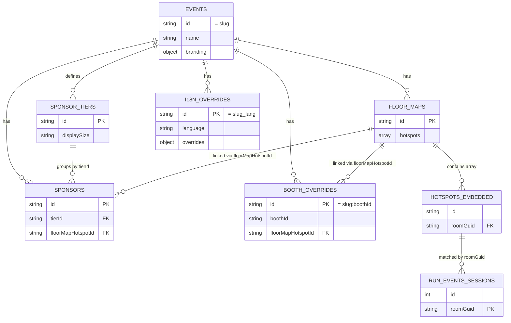

# Data Model

This document maps every type the system uses, where it lives, and how it
flows from upstream into the kiosk.

## Shared types

All types are defined in `packages/shared/src/types/` and re-exported from
`packages/shared/src/index.ts`. They split into three groups: run.events
upstream shapes, kiosk-facing transformed shapes, and admin-managed shapes.

### Event configuration

```ts
// packages/shared/src/types/event.ts
export interface PublicEventConfig {
  slug: string
  name: string
  timezone: string
  languages: string[]
  defaultLanguage: string
  branding: EventBranding
  days: EventDay[]
  startDate?: string
  endDate?: string
}

export type AdminEventConfig = PublicEventConfig & {
  id: string
  createdAt: string
  updatedAt: string
}
```

`PublicEventConfig` is the only shape the kiosk ever sees. `AdminEventConfig`
exists as a distinct type so admin-only fields never accidentally leak through
the public route — there's a regression test (`events.test.ts`) that asserts
the public route never returns secret-shaped keys.

`EventBranding` holds four `#rrggbb` colors plus optional `logoUrl`,
`logoLightUrl`, `fontFamily`. `EventDay` is `{ date: 'YYYY-MM-DD',
label: Record<lang, string> }`.

### Sponsors

```ts
// packages/shared/src/types/sponsor.ts
export interface Sponsor {
  id: string
  eventSlug: string
  name: string
  tierId: string                 // FK to SponsorTier
  description: Record<string, string>
  logoUrl: string
  website?: string
  boothNumber?: string
  floorMapHotspotId?: string     // optional deep-link to map
  sortOrder: number
  createdAt: string
  updatedAt: string
}

export interface SponsorTier {
  id: string
  eventSlug: string
  name: string
  label: Record<string, string>
  sortOrder: number
  displaySize: 'large' | 'medium' | 'small'
  createdAt: string
  updatedAt: string
}
```

### Floor maps

```ts
// packages/shared/src/types/floor-map.ts
export interface FloorMap {
  id: string
  eventSlug: string
  name: string
  label: Record<string, string>
  imageUrl: string               // Blob Storage URL
  sortOrder: number
  hotspots: Hotspot[]
  createdAt: string
  updatedAt: string
}

export interface Hotspot {
  id: string
  roomName: string
  roomId?: string
  roomGuid?: string              // matches RunEventsAgendaItem.roomGuid
  label: Record<string, string>
  points: [number, number][]     // 0..1 normalized polygon
  color?: string
}
```

`Hotspot.roomGuid` is the wiring that lets a session in the agenda show "Show
on map" — the kiosk finds a hotspot whose `roomGuid` matches the session's
`roomGuid` and pans to it.

### Booth overrides

```ts
// packages/shared/src/types/booth-override.ts
export interface BoothOverride {
  id: string                     // `${eventSlug}:${boothId}`
  eventSlug: string
  boothId: string
  floorMapHotspotId?: string
  updatedAt: string
}
```

Booths come from run.events but the link to a floor map hotspot is
kiosk-local. The public booths route merges the override in before sending to
the kiosk.

### Admins and i18n overrides

```ts
// packages/shared/src/types/admin.ts
export interface Admin {
  id: string
  email: string
  passwordHash: string           // bcrypt
  createdAt: string
}

export interface I18nOverrides {
  id: string                     // `${slug}_${language}`
  eventSlug: string
  language: string
  overrides: Record<string, string>  // i18n key → custom value
  updatedAt: string
}
```

## run.events upstream types

These match the actual API responses (`packages/shared/src/types/api.ts`).
We don't store these in Cosmos — the API server fetches them with `POST` and
caches in memory.

| Type | Endpoint |
|---|---|
| `RunEventsAgendaItem[]` | `POST /v2/events/:slug/agenda` |
| `RunEventsSpeaker[]` | `POST /v2/events/:slug/speakers` |
| `RunEventsBooth[]` | `POST /v2/events/:slug/booths` |
| `RunEventsPartnership[]` | `POST /v2/events/:slug/partnerships` (currently warmed but not surfaced as its own kiosk endpoint — partnerships are managed via Sponsors in Ziggy admin) |

Key fields on `RunEventsAgendaItem`:

- `id`, `guid` — stable identifiers
- `elementType` — 1 = Session, 2 = NonContent (breaks, lunch). The
  `/sessions/now` route filters `elementType === 1` only.
- `startDate`, `endDate` — ISO datetime *without* timezone, e.g.
  `"2026-06-01T08:30:00"`. Compared as strings against the event-timezone
  wall clock for "now" computation.
- `startTimeGroup` — `"08:30"`, used to group sessions into timeslots.
- `roomName`, `roomGuid` — `roomGuid` is the join key for floor-map hotspots.
- `speakers`, `labels` — arrays of nested refs.

## Transformed agenda

The API turns a flat `RunEventsAgendaItem[]` into a structured shape the
kiosk renders directly. See `packages/api/src/lib/run-events.ts:48`.

```ts
// packages/shared/src/types/api.ts
export interface AgendaSession { /* … session fields … */ }

export interface AgendaTimeslot {
  startTimeGroup: string         // "08:30"
  startDate: string              // earliest among sessions
  endDate: string                // latest among sessions
  sessions: AgendaSession[]
}

export interface AgendaDay {
  date: string                   // "2026-06-01"
  timeslots: AgendaTimeslot[]
}

export interface Agenda {
  days: AgendaDay[]
  timeZone: string
}
```

Transform algorithm:

1. Group items by `startDate.substring(0, 10)` → days.
2. Within each day, group by `startTimeGroup` → timeslots.
3. For each timeslot, compute `startDate = min(item.startDate)` and
   `endDate = max(item.endDate)` — covers the case where two parallel
   sessions in the same group have slightly different lengths.
4. Sort days, then timeslots within days, lexicographically (works because
   the date/time strings are zero-padded).

## Cosmos containers

Database name: `ziggy`. All defined in `infra/main.bicep`.

| Container | Partition key | One sentence |
|---|---|---|
| `events` | `/slug` | One document per event with id = slug. Holds the full `AdminEventConfig`. |
| `sponsors` | `/eventSlug` | One document per sponsor; references `tierId` and optionally `floorMapHotspotId`. |
| `sponsor-tiers` | `/eventSlug` | Tier definitions; `displaySize` controls kiosk rendering size. |
| `floor-maps` | `/eventSlug` | Floor map metadata + embedded `hotspots` array (no separate hotspot container). |
| `booth-overrides` | `/eventSlug` | Composite-id documents (`slug:boothId`) layering kiosk metadata over run.events booths. |
| `i18n-overrides` | `/eventSlug` | One document per `(slug, language)` pair with deterministic id `slug_lang`. |
| `admins` | `/email` | Admin users; the bootstrap admin uses fixed id `bootstrap`. |

## Page → endpoint → source matrix

| Kiosk page | API endpoints | Run.events | Cosmos | Blob |
|---|---|---|---|---|
| Now | `/sessions/now`, `/config` | agenda raw | events | logo |
| Agenda | `/agenda`, `/config` | agenda | events | logo |
| Speakers | `/speakers` | speakers | — | speaker images via run.events CDN |
| Map | `/floor-maps`, `/agenda`, `/booths`, `/sponsors` | agenda, booths | floor-maps, sponsors, booth-overrides | floor map images, sponsor logos |
| Expo | `/booths`, `/floor-maps` | booths | floor-maps, booth-overrides | — |
| Sponsors | `/sponsors`, `/sponsor-tiers`, `/floor-maps` | — | sponsors, sponsor-tiers, floor-maps | sponsor logos |
| Search | `/search` | search | — | — |
| Info | `/config` | — | events | — |
| (background) | `/i18n-overrides` | — | i18n-overrides | — |

## Container relationships



`HOTSPOTS_EMBEDDED` is not its own container — it's the `hotspots` array
inside each floor map document. It's drawn here so the join through `roomGuid`
to live run.events sessions is visible.

## Constants

`packages/shared/src/constants.ts`:

```ts
RUN_EVENTS_API_BASE = 'https://modesty.runevents.net'
CACHE_TTL_MS        = 5 * 60 * 1000
INACTIVITY_TIMEOUT_MS = 60 * 1000
MIN_SEARCH_LENGTH   = 4
SUPPORTED_LANGUAGES = ['nl', 'en', 'de', 'da', 'fr', 'it', 'el']
DEFAULT_LANGUAGES   = ['nl', 'en']
```
