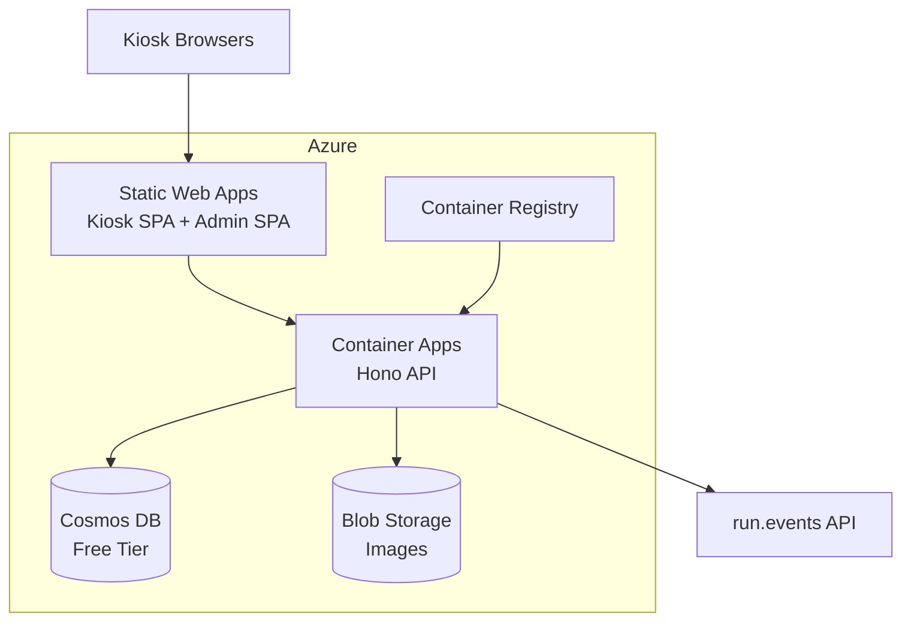
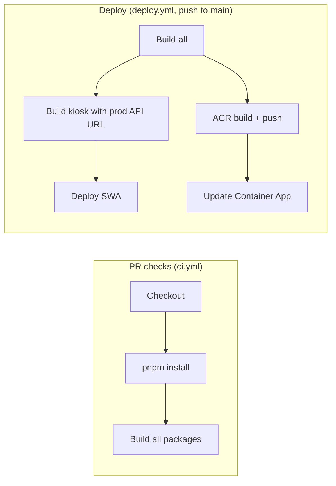

# Deployment

Ziggy runs on Azure with a minimal footprint optimized for cost.

## Infrastructure Overview



## Azure Resources

| Resource | SKU | Purpose |
|----------|-----|---------|
| Azure Cosmos DB | Serverless (free tier) | Document database for admin data |
| Azure Container Apps | Consumption plan | API hosting, scales 0–2 replicas |
| Azure Static Web Apps | Free tier | SPA hosting for kiosk and admin |
| Azure Blob Storage | Standard LRS | Floor map images, sponsor logos |
| Azure Container Registry | Basic | Docker image storage |

## CI/CD

GitHub Actions handles continuous integration and deployment.



### CI: Pull Request Checks

- Triggers on pull requests to `main`
- Installs dependencies, builds all packages
- Ensures nothing is broken before merge

### CD: Deploy on Push to Main

- Triggers on push to `main`
- Builds the kiosk SPA with the production API URL
- Deploys to Azure Static Web Apps
- Builds the API Docker image in Azure Container Registry
- Updates the Container App to pull the new image

## Manual Deployment

### Kiosk SPA

```bash
# Build with production API URL
cd packages/kiosk
VITE_API_URL=https://your-api.azurecontainerapps.io pnpm build

# Deploy to Azure Static Web Apps
npx @azure/static-web-apps-cli deploy dist --app-name your-swa-name --env production
```

### API

```bash
# Build Docker image in ACR (no local Docker needed)
az acr build --registry your-acr --image ziggy-api:latest --file packages/api/Dockerfile .

# Update Container App
az containerapp update --name ziggy-api --resource-group ziggy-rg --image your-acr.azurecr.io/ziggy-api:latest
```

### Admin SPA

```bash
cd packages/admin
VITE_API_URL=https://your-api.azurecontainerapps.io pnpm build
# Deploy similarly to kiosk via Static Web Apps CLI
```

## Container App Configuration

The API container requires these secrets set as environment variables:

- `RUN_EVENTS_API_KEY` — run.events API key
- `COSMOS_CONNECTION_STRING` — Cosmos DB connection string
- `JWT_SECRET` — JWT signing secret
- `STORAGE_CONNECTION_STRING` — Blob Storage connection string

Plus these plain env vars:
- `PORT=3001`
- `NODE_ENV=production`
- `EVENT_SLUG=experts-live-netherlands-2026`
