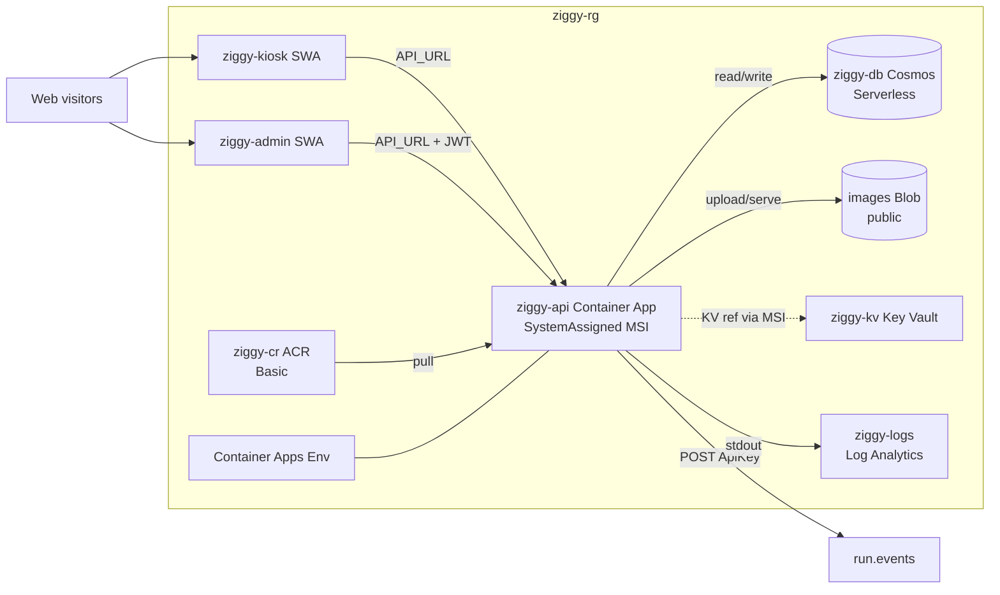
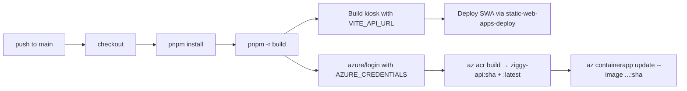

# Deployment

Ziggy runs on Azure in the `ziggy-rg` resource group. Two SPAs in Azure
Static Web Apps, one Hono container in Container Apps, Cosmos DB for admin
data, Blob Storage for images, Key Vault for secrets, ACR for images, Log
Analytics for runtime logs.

## Azure topology

| Resource | Name | SKU / tier | Purpose |
|---|---|---|---|
| Container App | `ziggy-api` | Consumption (scales 0–2) | Hono API. Public ingress on port 3001. System-assigned MSI. |
| Container Apps Environment | `ziggy-cae` | Linked to Log Analytics | Hosts the Container App. |
| Static Web App (kiosk) | `ziggy-kiosk` | Free | Hosts the kiosk SPA. Custom domain `ziggy.expertslive.dev` planned. Default: `victorious-plant-071edeb03.6.azurestaticapps.net`. |
| Static Web App (admin) | `ziggy-admin` | Free | Hosts the admin SPA. Custom domain `ziggy-admin.expertslive.dev` (live). Default: `gray-hill-067f71103.1.azurestaticapps.net`. |
| Cosmos DB | `ziggy-db-s4yz4bpkfrzam` | Serverless, North Europe | Database `ziggy`, seven containers (events, sponsors, sponsor-tiers, floor-maps, admins, i18n-overrides, booth-overrides). |
| Storage Account | `ziggystXXXXXXXX` | Standard LRS | Blob container `images` with public-blob access for sponsor logos and floor map images. |
| Container Registry | `ziggycrs4yz4bpkfrzam` | Basic, ACR admin user enabled | Holds `ziggy-api` images. |
| Key Vault | `ziggy-kv-af9a93` | Standard | Holds `jwt-secret` and `run-events-api-key`. Container App MSI granted "Key Vault Secrets User" via role assignment. |
| Log Analytics workspace | `ziggy-logs` | PerGB2018, 30-day retention | Container App stdout. |

## Topology diagram


```mermaid
flowchart LR
    subgraph Azure ["ziggy-rg"]
        SWAK[ziggy-kiosk SWA]
        SWAA[ziggy-admin SWA]
        CAE[Container Apps Env]
        CA[ziggy-api Container App<br/>SystemAssigned MSI]
        ACR[ziggy-cr ACR<br/>Basic]
        DB[(ziggy-db Cosmos<br/>Serverless)]
        BS[(images Blob<br/>public)]
        KV[ziggy-kv Key Vault]
        LA[ziggy-logs<br/>Log Analytics]
    end

    Web[Web visitors] --> SWAK
    Web --> SWAA
    SWAK -- API_URL --> CA
    SWAA -- API_URL + JWT --> CA
    CA -- POST ApiKey --> RE[run.events]
    CA -- read/write --> DB
    CA -- upload/serve --> BS
    CA -. KV ref via MSI .-> KV
    ACR -- pull --> CA
    CAE --- CA
    CA -- stdout --> LA
```

## Container App configuration

Bicep at `infra/main.bicep`. Highlights:

- **Identity:** `type: 'SystemAssigned'`. The principal is granted "Key Vault
  Secrets User" on `ziggy-kv-af9a93` (`kvSecretsUserRole` resource).
- **Secrets:** four are populated from inline Bicep (ACR password, Cosmos
  connection string, Storage connection string), two are KV-referenced
  (`run-events-api-key`, `jwt-secret`) with `keyVaultUrl` + `identity:
  'system'`.
- **Resources:** 0.25 vCPU, 0.5 GiB RAM. Auto-scales 0–2 replicas based on a
  50-concurrent-requests HTTP rule.
- **Probes:** startup probe hits `/api/warmup` (which warms the in-memory
  cache against run.events); readiness probe hits `/api/health` every 30s.
- **Ingress:** external on port 3001. CORS in Bicep is permissive
  (`allowedOrigins: ['*']`); the actual policy is enforced inside the app
  (`packages/api/src/index.ts`). A follow-up is to align Bicep with the app
  origins.

## CI/CD

Two workflows in `.github/workflows/`:

### `ci.yml` — pull-request checks

```mermaid
flowchart LR
    PR[PR opened or pushed] --> Checkout[actions/checkout@v4]
    Checkout --> PNPM[pnpm/action-setup@v4]
    PNPM --> Node[setup-node@v4 node 22]
    Node --> Install[pnpm install --frozen-lockfile]
    Install --> Audit[pnpm audit --prod --audit-level=high]
    Audit --> Build[pnpm -r build]
```

The pnpm version is read from the `packageManager` field in
`package.json` — do not pass `version:` to `pnpm/action-setup`, it will
conflict.

### `deploy.yml` — push to main


```mermaid
flowchart LR
    Push[push to main] --> CK[checkout]
    CK --> PN[pnpm install]
    PN --> BLD[pnpm -r build]
    BLD --> KB[Build kiosk with VITE_API_URL]
    KB --> SWA[Deploy SWA via static-web-apps-deploy]
    BLD --> AZ[azure/login with AZURE_CREDENTIALS]
    AZ --> ACRB[az acr build → ziggy-api:sha + :latest]
    ACRB --> UPD[az containerapp update --image ...:sha]
```

Required GitHub secrets:

| Secret | Purpose |
|---|---|
| `AZURE_CREDENTIALS` | Service principal `ziggy-github-actions`, scoped Contributor on `ziggy-rg`. JSON output of `az ad sp create-for-rbac --sdk-auth`. |
| `API_URL` | Production API URL, baked into the kiosk build as `VITE_API_URL`. |
| `ACR_NAME` | ACR name (e.g. `ziggycrs4yz4bpkfrzam`) for `az acr build`. |
| `SWA_DEPLOYMENT_TOKEN` | Static Web App deployment token for the kiosk SWA. |

## Manual deploy procedures

### API

```bash
az acr build \
  --registry ziggycrs4yz4bpkfrzam \
  --image ziggy-api:$(git rev-parse --short HEAD) \
  --image ziggy-api:latest \
  --file packages/api/Dockerfile .

az containerapp update \
  --name ziggy-api \
  --resource-group ziggy-rg \
  --image ziggycrs4yz4bpkfrzam.azurecr.io/ziggy-api:$(git rev-parse --short HEAD)
```

### Kiosk

```bash
cd packages/kiosk
VITE_API_URL=https://<container-app-host> \
VITE_BUILD_HASH=$(git rev-parse --short HEAD) \
  pnpm build

npx swa deploy dist \
  --app-name ziggy-kiosk \
  --env production \
  --deployment-token "$SWA_DEPLOYMENT_TOKEN"
```

### Admin

```bash
cd packages/admin
VITE_API_URL=https://<container-app-host> pnpm build

npx swa deploy dist \
  --app-name ziggy-admin \
  --env production \
  --deployment-token "$ADMIN_SWA_DEPLOYMENT_TOKEN"
```

## Bicep refactor history

`jwtSecret` and `runEventsApiKey` used to be Bicep parameters, which meant
they got rewritten on every `az deployment group create` (and risked being
captured in deployment history). They now live in Key Vault and are referenced
by the Container App's secret-from-keyvault syntax with the system-assigned
managed identity. The Bicep file declares the vault as `existing` and takes
its name as a parameter (`keyVaultName`, default `ziggy-kv-af9a93`).

To rotate either secret, update the value in KV and restart the Container App
revision — no Bicep redeploy needed. This is the only intended path for
secret rotation.

## See also

- [event-ready-deploy-runbook.md](./event-ready-deploy-runbook.md) — pre/post
  deploy checklist with smoke-test commands for headers, warmup, and kiosk
  outage behavior.
- [azure-costs.md](./azure-costs.md) — monthly cost expectations.
- [security.md](./security.md) — KV refs, MSI, and the rotation flow in
  detail.
