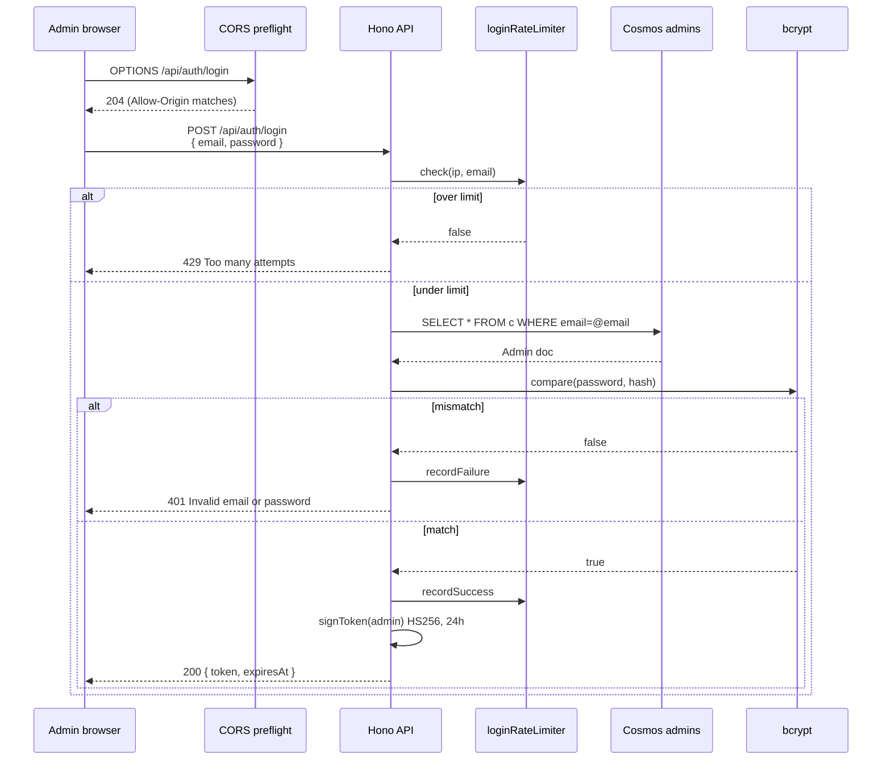

# Security

## Threat model

The kiosk is unauthenticated and serves the public web — assume the attacker
is an anonymous user who can fuzz any public endpoint, abuse uploads, and
probe for misconfiguration. The admin panel is reachable on the same
internet but is JWT-gated; the realistic threat there is brute-force login,
token theft via XSS, and malformed admin writes that poison kiosk rendering.
Operator credentials are trusted — this is an event-staff tool, not a
multi-tenant SaaS.

## Secret management

All long-lived secrets live in **Azure Key Vault** (`ziggy-kv-af9a93`):

- `jwt-secret` — HS256 signing key, ≥32 characters
- `run-events-api-key` — upstream `ApiKey` header value

The Container App has a **system-assigned managed identity**, granted the
"Key Vault Secrets User" role on the vault (Bicep `kvSecretsUserRole`
resource at `infra/main.bicep:273`). Container App secrets reference KV
directly:

```bicep
{
  name: 'jwt-secret'
  keyVaultUrl: '${keyVault.properties.vaultUri}secrets/jwt-secret'
  identity: 'system'
}
```

Cosmos and Storage connection strings are pulled from the resources via
`listConnectionStrings()` / `listKeys()` in Bicep and surfaced as Container
App secrets. These are not yet KV-backed (a follow-up — see below).

### Rotation flow

1. In KV, add a new version of the secret value.
2. Restart the Container App revision so it picks up the new value:
   `az containerapp revision restart -n ziggy-api -g ziggy-rg --revision <rev>`.
3. For `jwt-secret` rotation: existing tokens become invalid (forces a new
   admin login). Bcrypt password hashes are not affected — they don't depend
   on `JWT_SECRET`.

## JWT model

Implementation in `packages/api/src/lib/auth.ts`.

- Algorithm: **HS256** (explicit `algorithms: ['HS256']` on verify)
- Issuer: **`ziggy`** (enforced)
- Audience: **`ziggy-admin`** (enforced)
- Expiry: **24 hours**
- Subject claim (`sub`): admin id
- Custom `email` claim
- Stored client-side in `localStorage` (a known follow-up — see below)

`getEnv()` throws at startup in production if `JWT_SECRET` is missing or
shorter than 32 chars (`packages/api/src/env.ts:24`).

## Setup endpoint lockdown

`POST /api/auth/setup` is the only path that creates an admin without
existing credentials. Three independent gates:

```
                ┌─ env SETUP_TOKEN unset → 503 Setup disabled
                │
   request ─────┼─ X-Setup-Token mismatch → 401 Invalid setup token
                │
                ├─ admins container non-empty → 403 Admin already exists
                │
                └─ all gates pass → 201 { token, expiresAt }
```

Race losing the upsert returns `409`. After bootstrap, **unset `SETUP_TOKEN`
in the Container App** to disable the route entirely.

## Login rate limiting

`packages/api/src/middleware/rate-limit.ts` — in-process sliding-window
limiter keyed by `(ip, email.toLowerCase())`. Defaults: **5 failures per 15
minutes**. A successful login deletes the bucket; failures (and 429s) come
from `loginRateLimiter.check()` returning false. Single-replica only — fine
for our single-container deployment, would need a shared store for
horizontal scale.

## Admin write validation

All `POST`/`PUT` admin handlers run their bodies through zod schemas in
`packages/api/src/schemas/admin.ts`:

- Output objects are **explicitly constructed** field by field — no
  `...body` spread anywhere. Unknown fields can't sneak into Cosmos.
- Strings are bounded (e.g. sponsor name 1–200, description 0–2000,
  i18n key 0–200, value 0–1000).
- URLs require `https://`.
- Colors require `#rrggbb`.
- Hotspot points are `[number 0–10000, number 0–10000]` tuples, 3–50 per
  hotspot, ≤100 hotspots per map.
- i18n records use a strict object with one optional key per
  `SUPPORTED_LANGUAGES` entry — unknown language codes are rejected.
- Body size capped at **1 MB** for all `/api/admin/*` except `/api/admin/upload`.

## Upload hardening

`POST /api/admin/upload`:

- 25 MB ceiling.
- Magic-byte sniff (`packages/api/src/lib/magic-bytes.ts`) — only JPEG, PNG,
  WebP. SVG and GIF are rejected. Client-supplied MIME and filename are
  ignored.
- Blob name = `crypto.randomUUID() + extensionFor(detectedType)`. User
  filenames never appear in the URL.
- Blob written with `Cache-Control: public, max-age=31536000, immutable`,
  `Content-Disposition: inline`, metadata `x-content-type-options: nosniff`.
- Container is public-read (`publicAccess: 'Blob'`) — uploads are
  immediately addressable. Admin-only because only authenticated admins can
  upload.

## Security headers

API (Hono `secureHeaders()` middleware): `X-Frame-Options: DENY`,
`X-Content-Type-Options: nosniff`, `Referrer-Policy:
strict-origin-when-cross-origin`, `Strict-Transport-Security: max-age=31536000;
includeSubDomains`.

Static Web Apps (kiosk and admin both have a `staticwebapp.config.json`
with):

```
Content-Security-Policy:
  default-src 'self';
  img-src 'self' https: data:;
  script-src 'self';
  style-src 'self' 'unsafe-inline';
  font-src 'self' data:;
  connect-src 'self' https:;
  frame-ancestors 'none';
  base-uri 'self'
X-Content-Type-Options: nosniff
Referrer-Policy: strict-origin-when-cross-origin
Permissions-Policy: geolocation=(), camera=(), microphone=()
Strict-Transport-Security: max-age=31536000; includeSubDomains
```

CSP rationale:

- `style-src 'self' 'unsafe-inline'` — Tailwind v4 + Vite dev tooling
  generate inline style attributes for some components, and there's no
  practical hash/nonce path with the SWA build pipeline. Acceptable because
  XSS into a styled element is much narrower than full script injection.
- `img-src 'self' https: data:` — sponsor logos and floor maps live on
  Azure Blob Storage; speakers come from run.events' CDN. We don't know the
  exact host list ahead of time, hence `https:`.
- `connect-src 'self' https:` — kiosk fetches the API on a different
  origin (`*.azurecontainerapps.io`). `https:` is broad on purpose so we
  don't have to redeploy the SWA every time the API host changes.
- `frame-ancestors 'none'` — modern, CSP-native iframe denial. The
  legacy `X-Frame-Options: DENY` from the API middleware still applies for
  older browsers that ignore CSP.

## Public projection

`GET /api/events/:slug/config` builds a fresh `PublicEventConfig` object
from explicit fields:

```ts
const publicConfig: PublicEventConfig = {
  slug, name, timezone, languages, defaultLanguage,
  branding, days, startDate, endDate,
}
return c.json(publicConfig)
```

The original `EventConfig.apiKey` field — present in early versions and
prone to leaking the run.events key — has been deleted from the shared
type. A regression test in `packages/api/src/routes/events.test.ts`
asserts the public response never contains `apiKey`/`password`/secret-shaped
keys.

## Logging redaction

`packages/api/src/lib/run-events.ts:38` throws
`run.events API error ${response.status} for ${method} ${path}` — the
upstream response body is never read into the error, so it can't leak into
the API logs even if run.events echoes the request back.

Hono request logger is enabled globally; tokens never appear in the path
and the `Authorization` header is not written by the logger. Auth route
handlers do not log credentials.

## Successful admin login



## Known follow-ups

Tracked in [security-hardening-review.md](./security-hardening-review.md):

- Move admin tokens from `localStorage` to **HttpOnly; Secure; SameSite**
  cookies + CSRF.
- Migrate GitHub Actions to **OIDC federated credentials** with minimal
  permissions; SHA-pin third-party actions.
- **Azure managed identity** for ACR pulls (disable admin user), Cosmos,
  and Storage. Move connection strings into KV until then.
- **Structured audit logging** for login success/failure, setup attempts,
  admin mutations, uploads, deletes; alert on anomalies.
- Consider switching the bootstrap admin upsert to `create()` for
  conflict-throwing idempotency (the SETUP_TOKEN gate is the primary
  defense).

## See also

- [security-hardening-review.md](./security-hardening-review.md) — original
  audit (April 2026), lists every finding by priority.
- [event-ready-deploy-runbook.md](./event-ready-deploy-runbook.md) — pre/post
  deploy checklist with curl-based verification commands for every header.
