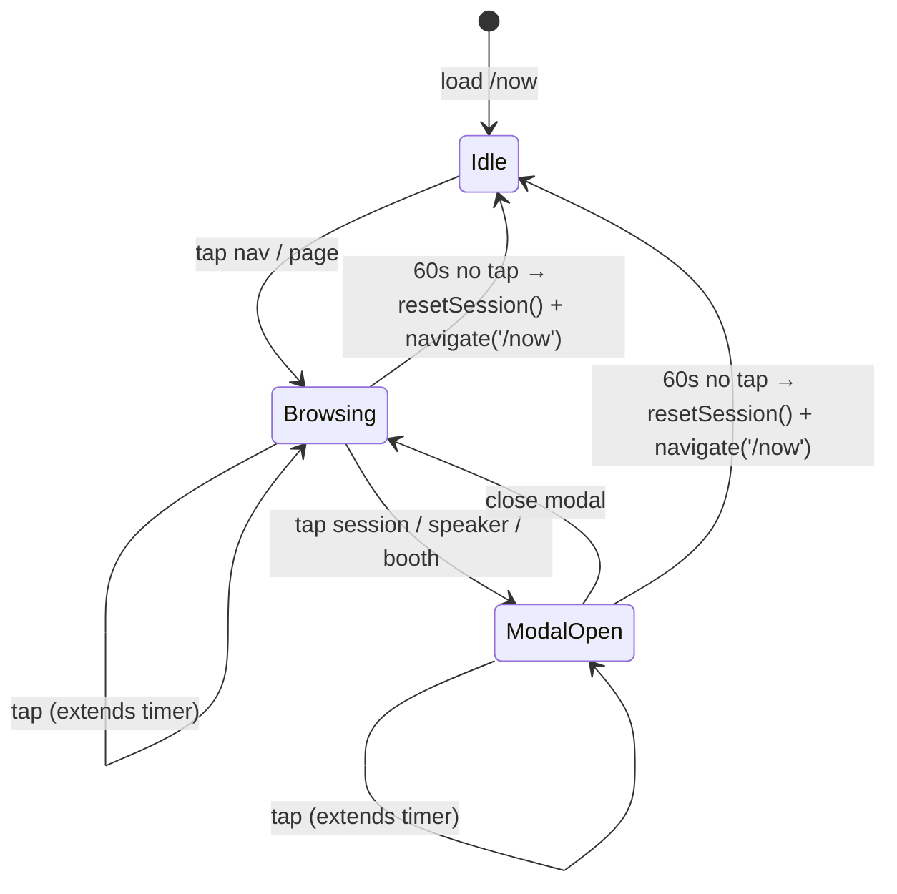

# State Management

The kiosk has two distinct kinds of state: server data (cached by TanStack
Query) and per-session UI state (a single Zustand store). This split is what
makes the inactivity reset trivial — clearing the store wipes everything an
attendee might have touched, while the server cache stays warm for the next
person.

## The Zustand store

Defined in `packages/kiosk/src/store/kiosk.ts`. One store, fewer than 100
lines, no slicing.

| Field | Lifetime | Purpose |
|---|---|---|
| `eventSlug` | Stable | Read from `VITE_EVENT_SLUG` at boot. Never mutated. |
| `language` | Stable, but reset on inactivity | Active i18n language. Defaults to `nl`. |
| `lastInteraction` | Stable | `Date.now()` of the most recent tap; used by the inactivity timer. |
| `selectedDayIndex` | Per-session | Which day tab is active on the agenda page. |
| `openSessionId` / `openSpeakerId` / `openBoothId` | Per-session | Drives the three detail modals. Only one is ever non-null at a time. |
| `searchQuery` | Per-session | Text in the search input. |
| `selectedMapId` | Per-session | Which floor map is shown on `/map`. |
| `mapHighlightId` | Per-session | Hotspot to pulse — set by deep links from session/booth/sponsor detail. |
| `agendaLabelFilter` | Per-session | Array of label names the agenda page filters by. |
| `fontScale` | Per-session | One of `1`, `1.2`, `1.4`. Applied to `document.documentElement`. |
| `theme` | Per-session | `'default'` or `'high-contrast'`. Applied via `data-theme` attribute on the root div. |

Per-session fields are gathered into a single `INITIAL_SESSION` constant.
`resetSession()` does a single `set({ ...INITIAL_SESSION, language:
DEFAULT_LANGUAGE })` — that's the entire reset.

## Inactivity reset

`packages/kiosk/src/hooks/useInactivityReset.ts`:

```ts
const timer = setInterval(() => {
  if (Date.now() - lastInteraction >= 60_000) {
    resetSession()
    navigate('/now', { replace: true })
  }
}, 1000)
```

`App.tsx` wires `onTouchStart` and `onClick` on the root div to call
`store.touch()`, which sets `lastInteraction = Date.now()`. The interval is
keyed on `lastInteraction`, so React reschedules the timer effect every time
the user touches anything — there's no separate ref-juggling.



Why all session state lives in the store: any component holding local state
would need its own reset wiring, and a missed component leaks data between
attendees (open modal, lingering search query, sticky high-contrast). With
everything in the store, the reset is a single `set()` and the bug surface is
zero.

## The `?now=` URL override

`packages/kiosk/src/lib/clock.ts` reads `?now=` from `window.location.search`
once and freezes the clock at that ISO timestamp. Used to validate kiosk
behavior before the event starts:

```
http://localhost:5173/now?now=2026-06-01T09:30:00
```

The `useClockTick()` hook returns the parsed Date, and the `now` page uses
this to find current/upNext sessions. Without an override the clock ticks
every 30 seconds. The override is also forwarded as a `?now=…` query param
to `GET /api/events/:slug/sessions/now` (via `useNowSessions`), so the
server filters `current` / `upNext` / `currentBreaks` against the same
instant — visiting `/now?now=2026-06-02T12:30:00Z` shows exactly what the
kiosk renders during lunch (NonContent break card), not just shifted client
clocks.

## Deep link state pattern

From a session, booth, or sponsor detail screen, the "Show on map" button
calls:

```ts
setSelectedMap(targetMapId, hotspotId)
navigate('/map')
```

`MapPage` reads `selectedMapId` and `mapHighlightId` from the store, picks
the floor map from the React Query cache, auto-pans to the polygon, and
applies the `.hotspot-pulse` CSS class (drop-shadow + 2-second amber pulse,
defined in `index.css`).

For sessions the `hotspotId` is resolved by matching `session.roomGuid`
against `hotspot.roomGuid` (set per hotspot in the admin). For booths and
sponsors, the `floorMapHotspotId` is stored directly on the document
(booth-overrides for booths, sponsor doc for sponsors).

## React Query persistence

`packages/kiosk/src/lib/queryClient.ts`:

```ts
new QueryClient({
  defaultOptions: {
    queries: {
      retry: 3,
      retryDelay: (attempt) => Math.min(1000 * 2 ** attempt, 10_000),
      staleTime: 60_000,
      gcTime: 24 * 60 * 60 * 1000,
      refetchOnWindowFocus: false,
      networkMode: 'offlineFirst',
    },
  },
})

createSyncStoragePersister({
  storage: window.localStorage,
  key: 'ziggy-query-cache',
})
```

Why each setting:

- `retry: 3` with exponential backoff (1s → 2s → 4s, capped at 10s) — covers
  brief network blips.
- `staleTime: 60_000` — once data is loaded, refetch only after 60s of
  unused state.
- **`gcTime: 24 * 60 * 60 * 1000` (24h)** — TanStack would otherwise garbage-
  collect cached queries 5 minutes after they're unmounted. With 24h, a
  kiosk left running overnight wakes up with usable data on the first tap;
  no white screen while the API spins back up.
- `networkMode: 'offlineFirst'` — fetch attempts are made even if the
  browser thinks it's offline; combined with persistence, the kiosk renders
  cached data immediately on every reload.
- The persister key `'ziggy-query-cache'` is busted by `VITE_BUILD_HASH`
  (the deploy step builds the kiosk with the build SHA in the env), so a
  new release invalidates the localStorage cache without manual action.

## Theme and font scale

Both are CSS-side concerns plumbed through one Zustand field each.

**Theme** — `App.tsx` sets `data-theme={theme}` on the root div. Tailwind v4
emits `var(--color-el-blue)` and friends from the `@theme` block, and an
`[data-theme='high-contrast']` selector in `index.css` overrides those
variables. Because every utility class reads from the variable, the override
cascades to every `bg-el-blue`, `text-el-light`, etc. with no per-component
work.

**Font scale** — `App.tsx` runs:

```ts
useEffect(() => {
  document.documentElement.style.fontSize = `${fontScale * 18}px`
}, [fontScale])
```

The base font-size is set on `<html>` (not on a child div) because Tailwind's
`rem`-based spacing utilities resolve against the root font size. Setting
`html.style.fontSize` rescales padding, margin, gap, line-height — basically
the entire layout — without touching anything else.

## See also

- [architecture.md](./architecture.md) — for the bigger data flow context
- [data-model.md](./data-model.md) — for the shape of cached server state
